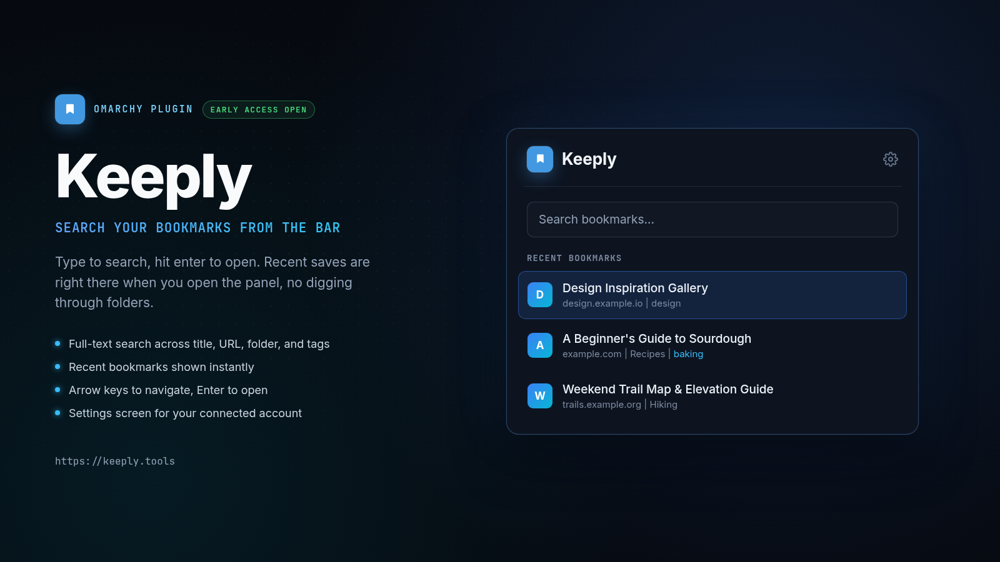

# Keeply for Omarchy

Search and browse your [Keeply](https://keeply.tools) bookmarks right from the [Omarchy](https://omarchy.dev) menu bar.

Click the bookmark icon, type to search, hit enter to open. Built for the moment you want a link you saved last week without alt-tabbing to a browser tab and digging through folders.

## Screenshot



## Keyboard

With the panel open, type to search and results update as you type. Arrow keys move the highlighted result, Enter opens it (closing the panel), Escape closes the panel. Click a result with the mouse to open it directly.

## What you get

- **Recent bookmarks**: your latest saves, right under the search field, with no query needed
- **Full-text search**: type to search title, URL, folder, and tags
- **One-click open**: click or press Enter on any result to open it in your default browser
- **Folder and tag context**: each result shows which folder it's in and its first few tags
- **Settings screen**: click the gear icon to see your connected account and sign out

## Install

```bash
omarchy plugin add https://github.com/Keeply-link/keeply-omarchy.git --enable
```

Or for local development:

```bash
git clone https://github.com/Keeply-link/keeply-omarchy.git
cd keeply-omarchy
ln -sfn "$PWD" ~/.config/omarchy/plugins/io.github.rolfkoenders.keeply
omarchy restart shell
omarchy plugin enable io.github.rolfkoenders.keeply
```

## Setup

1. Click the Keeply icon in your menu bar
2. Click "Connect" to start the OAuth flow
3. Sign in to Keeply in your browser and authorize the plugin
4. You're connected, start searching your bookmarks

## Configure

The bar icon defaults to the right side of the bar. To move it:

```bash
omarchy bar move io.github.rolfkoenders.keeply --section right
```

## Remove

```bash
omarchy plugin remove io.github.rolfkoenders.keeply
```

This disconnects the plugin. Your saved token is removed from the system keyring on sign-out; if you remove the plugin while still signed in, clear it manually:

```bash
secret-tool clear application io.github.rolfkoenders.keeply
```

## Requirements

- [Omarchy](https://omarchy.dev)
- Python 3 (for the OAuth flow's local callback server)
- A Keeply account (free)

## Privacy

- Authentication uses OAuth with PKCE, so no client secret is ever stored, on your machine or anywhere else
- Your access token is stored only in the system keyring (via `secret-tool`), never in a config file or log
- All API calls go directly to `https://api.keeply.tools`

## License

MIT, see [LICENSE](LICENSE).
